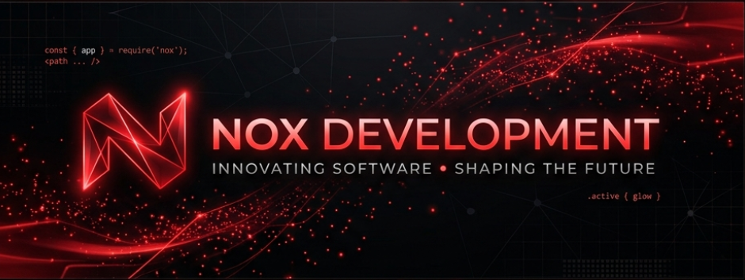

<!-- Header Banner -->

 

---

<table align="center">
  <tr>
    <td width="50%" align="left">
      <h3> <b>HQ OPERATIONS</b></h3>
      
<b>NOX DEVELOPMENT</b> is a high-octane engineering collective. We architect digital systems that hit different. From high-performance Discord infrastructure to next-gen web applications.

       
      
    </td>
    <td width="50%" align="center">
      
    </td>
  </tr>
</table>

 

<table align="center">
  <tr>
    <td align="center">
       
    </td>
    <td align="center">
       
    </td>
  </tr>
</table>

 

  

 

  

 

  
  
  

 

